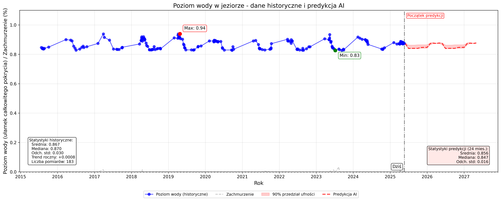

# MasurianWaterVision

MasurianWaterVision is a satellite-based analysis and forecasting tool designed to monitor lake water levels using Sentinel-2 imagery and meteorological data. The project leverages EO-Learn for image processing, machine learning for prediction, and data visualization tools for comprehensive water level analysis.

---

## 🌐 Project Goals

- Automatically download and process Sentinel-2 imagery for a defined lake boundary.
- Detect and filter cloud and ice-affected images.
- Monitor water level dynamics based on NDWI (Normalized Difference Water Index).
- Incorporate weather station data (Meteostat) for deeper correlation analysis.
- Predict future water levels using machine learning (Random Forest).
- Visualize trends, anomalies, and seasonal behaviors through ready-to-use plots.

---

## 🗂️ Project Structure

```

MasurianWaterVision/
│
├── config/                 # Project configuration and environment setup
│   └── settings.py
│
├── data/                   # Contains lake boundary WKT file and raw data
│   └── lake_boundary.wkt
│
├── src/                    # Core source code
│   ├── data_handling/      # Geospatial preprocessing
│   ├── eolearn/            # EO-Learn tasks and pipeline definition
│   ├── modeling/           # ML model training, weather feature integration
│   ├── utils/              # Utility functions (e.g., save plots)
│   └── visualization/      # Visualization and analysis scripts
│
├── .gitignore              # Files/folders to ignore by Git
├── main.py                 # Entry point for the analysis pipeline
├── requirements.txt        # Python dependencies
└── README.md               # Project documentation (this file)

````

---

## ⚙️ Environment Variables

Create a `.env` file in the root folder to configure parameters for satellite downloads, model behavior, and paths.

### Required `.env` Content:

```env
# === Data paths ===
WKT_FILE_PATH=data/lake_boundary.wkt       # Path to WKT file describing lake boundary
CACHE_FOLDER=cached_data                   # Folder for caching downloaded EOPatches
PLOTS_FOLDER=plots                         # Folder for saving generated plots
DATA_FOLDER=data                           # Folder for data storage

# === Satellite imagery parameters ===
SATELLITE_IMAGE_RESOLUTION=10              # Spatial resolution in meters
MAX_CLOUD_COVERAGE_DOWNLOAD=0.8            # Max cloud coverage during download (0.0 - 1.0)
CLOUD_THRESHOLD=0.05                       # Max allowed cloud mask coverage per image
ICE_THRESHOLD=0.6                          # Max NDSI threshold to discard ice-affected images

# === Analysis parameters ===
BOUNDARY_BUFFER_PERCENTAGE=0.1             # Percentage buffer around lake boundary for download area
TIME_RANGE_YEARS=10                        # How many years of data to consider
PREDICTION_MONTHS=24                       # Number of months for water level forecasting
WATER_LEVEL_MEDIAN_THRESHOLD=0.98          # Threshold for discarding outlier water level estimates

# === Weather parameters ===
METEOSTAT_STATION_ID=12280                 # Meteostat weather station ID (e.g., for Giżycko)

# === API Keys ===
SH_CLIENT_ID=your_sentinelhub_client_id
SH_CLIENT_SECRET=your_sentinelhub_client_secret
````

> ⚠️ **Note:** You must have valid Sentinel Hub API credentials to download satellite data.

---

## 💻 Installation Instructions

### Step-by-step setup

#### 1. Clone the repository

```bash
git clone https://github.com/mec0why/MasurianWaterVision.git
cd MasurianWaterVision
````

---

### Option A – Using a Virtual Environment (Recommended)

#### ✅ Windows (PowerShell):

```powershell
python -m venv venv
.\venv\Scripts\Activate.ps1
```

#### ✅ Windows (CMD):

```cmd
python -m venv venv
venv\Scripts\activate.bat
```

#### ✅ Linux / macOS:

```bash
python3 -m venv venv
source venv/bin/activate
```

Then install dependencies:

```bash
pip install -r requirements.txt
```

---

### Option B – Without Virtual Environment (Advanced Users)

If you prefer to install dependencies globally or inside an existing environment:

```bash
pip install -r requirements.txt
```

> ⚠️ Make sure you are using **Python 3.9+**, and that your system packages don’t conflict with required versions (see `requirements.txt`).

---

### 2. Set up `.env` configuration

Create a `.env` file in the root directory. Use the example in this README to define paths, thresholds, and API keys.

---

### 3. Run the project

```bash
python main.py
```

The script will:

* Download and preprocess satellite scenes
* Apply water mask and filtering
* Train and validate a Random Forest model
* Predict future water levels
* Generate visual reports to the `plots/` folder

---

## 📊 Outputs & Visualizations

Upon completion, the following plot files will be generated:

| File                              | Description                                    |
| --------------------------------- | ---------------------------------------------- |
| `lake_boundary.png`               | WKT-derived shape of the lake                  |
| `first_image.png`                 | RGB + mask overlay of the first valid scene    |
| `last_image.png`                  | RGB + mask overlay of the last valid scene     |
| `highest_water_level.png`         | Visual scene with highest detected water level |
| `lowest_water_level.png`          | Scene with the lowest water extent             |
| `water_levels_timeline.png`       | Timeline with AI-predicted future water levels |
| `seasonal_water_levels.png`       | Seasonal water behavior (monthly aggregation)  |
| `water_level_histogram.png`       | Histogram of observed water level distribution |
| `water_mask_comparison.png`       | Visual diff of water masks (min vs max)        |
| `ndvi_comparison.png`             | NDVI differences across dates of interest      |
| `weather_feature_correlation.png` | Weather correlation to water levels            |

All outputs are saved to the folder specified by `PLOTS_FOLDER`.

---

### 🖼️ Example Output

Example timeline with predicted water levels (AI forecast):



> Plots like this are saved to the `plots/` directory after processing.

---

## 🧠 Machine Learning Model

The prediction model is a Random Forest Regressor trained on:

* Historical water level estimates
* Meteostat weather parameters:

  * Avg, Min, Max Temperature
  * Precipitation
  * Snow depth
* Time-based features (seasonality, month, year, etc.)

The model predicts water levels over the configured number of months (`PREDICTION_MONTHS`).

---

## 📦 Dependencies in Detail

The project relies on the following key Python libraries:

| Library                 | Purpose                                                 |
| ----------------------- | ------------------------------------------------------- |
| `eo-learn`              | Satellite imagery processing with EO patches            |
| `sentinelhub`           | API access to Sentinel Hub (Sentinel-2 imagery)         |
| `geopandas`, `shapely`  | Handling WKT lake boundaries and geometry buffers       |
| `scikit-learn`          | Training and using Random Forest models                 |
| `meteostat`             | Fetching weather station data (temperature, snow, etc.) |
| `matplotlib`, `seaborn` | Plotting and visualization                              |

All required versions are specified in `requirements.txt`.

---

## 🌍 Data Sources & Documentation

* **Sentinel Hub** – [https://docs.sentinel-hub.com](https://docs.sentinel-hub.com)
* **EO-Learn** – [https://eo-learn.readthedocs.io](https://eo-learn.readthedocs.io)
* **Meteostat** – [https://dev.meteostat.net](https://dev.meteostat.net)

---

## ⚠️ Known Limitations

* ❄️ Winter images with snow or ice can limit usable scenes despite filtering.
* 🛰️ Sentinel Hub rate limits may slow down large-area or high-frequency downloads.
* 🌊 Prediction model assumes a single consistent water body — complex reservoirs or rivers may require adaptation.
* 📈 Very large lakes may lead to performance bottlenecks (EO patches can get large).
* 📅 Time series forecasting works best with multiple years of consistent data.

---

> Empowering environmental insight through open data and satellite technology.